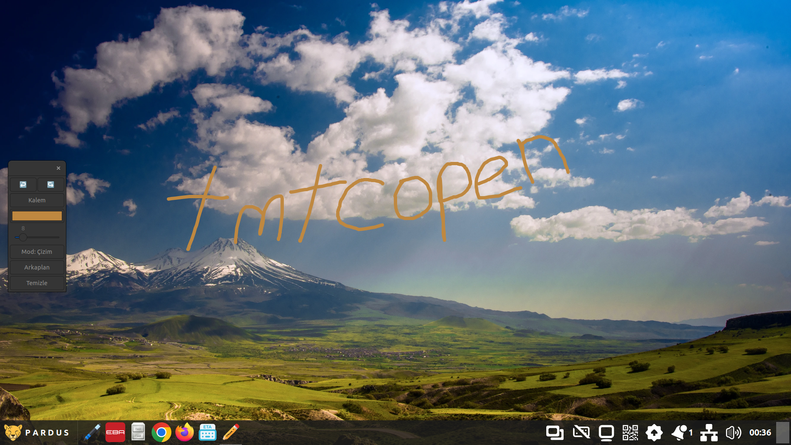

#  tmtcopen

**tmtcopen**, Pardus yüklü akıllı tahtalar için özel olarak optimize edilmiş, Rust ile geliştirilmiş bir ekrana çizim yapma uygulamasıdır. Ancak tüm X11 pencere yöneticilerinde kullanılabilir(Wayland'e tam destek yok).

### Özellikler:
* Kalınlık ve renk seçimlerini hatırlar
* Çizimleri silmeden ekran dokunmatiğini aktif edebilir
* Kalem/Silgi/Temizle/Geri Al/İleri Al fonksiyonları
* Ekran alan yakınlaştırma
* Ekran arka planı ekleme

### Kurulum
* [Releases](https://github.com/tmtco1/tmtcopen/releases/latest/) kısmından .deb dosyasını indirip kurun

## Değişiklikler
### v0.4.2
* Kullanıcı deneyimi geliştirildi, detaylı bilgi için CHANGELOG.md dosyasına bakın.

Daha eski değişiklikler için [CHANGELOG.md](./CHANGELOG.md) dosyasına göz atın.
